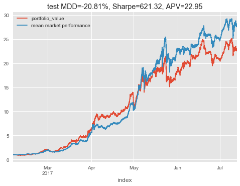

Attempting to replicate "A Deep Reinforcement Learning Framework for the Financial Portfolio Management Problem" by [Jiang et. al. 2017](https://arxiv.org/abs/1706.10059) [1].

tl;dr I managed to get 8% growth on training data, but it disapeared on test data. However, RL papers can be very difficult to replicate due to bugs, framework differences, and hyperparameter sensistivity.

This paper trains an agent to choose a good portfolio of cryptocurrencies. It's reported that it can give 4-fold returns in 50 days and the paper seems to do all the right things so I wanted to see if I could acheive the same results.

This repo includes an environment for portfolio management (with unit tests). Hopefully others will find this usefull as I am not aware of any other implementations (as of 2017-07-17).

The main differences from Jiang et. al. 2017 are:

- The first step in a deep learning project should be to make sure the model can overfit, this provides a sanity check. So I am first trying to acheive good results with no trading costs.
- I have not used portfolio vector memory. Normally this would lead to it incurring large trading costs, but as I have disabled trading costs this shouldn't be a problem.
- Instead of DPG ([deterministic policy gradient](http://jmlr.org/proceedings/papers/v32/silver14.pdf)) I tried and DDPG ([deep deterministic policy gradient]( http://arxiv.org/pdf/1509.02971v2.pdf)) and VPG (vanilla policy gradient) with generalized advantage estimation and PPO.
- I tried to replicate the best performing CNN model from the paper and haven't attempted the LSTM or RNN models.
- instead of selecting 12 assets for each window I chose 8 assets that have existed for the longest time
- My topology had an extra layer [see issue 3](https://github.com/wassname/rl-portfolio-management/issues/3)

Author: wassname

License: AGPLv3

[[1](https://arxiv.org/abs/1706.10059)] Jiang, Zhengyao, Dixing Xu, and Jinjun Liang. "A Deep Reinforcement Learning Framework for the Financial Portfolio Management Problem." *arXiv preprint arXiv:1706.10059* (2017).

# TODO

See issue [#4](https://github.com/wassname/rl-portfolio-management/issues/4) and [#2](https://github.com/wassname/rl-portfolio-management/issues/2) for ideas on where to go from here

# Results

I have managed to overfit to the training data with no trading costs but it could not generalise to the test data. So far there have been poor results. I have not yet tried hyperparameter optimisation so it could be that parameter tweaking will allow the model to fit, or I may have subtle bugs.

- VPG model, training: 1.008 in 15 hours, 1.9 in 50 days
- VPG model, test: 1.00 in 15 hours, 1.0 in 50 days
- [DDPG model](https://github.com/wassname/rl-portfolio-management/blob/8c74f136765f621eb45d484553b9f778e9243a84/keras-ddpg.ipynb), test



This test period is directly after the training period and it looks like the usefullness of the models learned knowledge may decay as it moves away from its training interval.

# Installing

- `git clone https://github.com/wassname/rl-portfolio-management.git`
- `cd rl-portfolio-management`
- `pip install -r requirements/requirements.txt`
- `jupyter-notebook`
    - Then open tensorflow-VPG.ipynb in jupyter
    - Or try an alternative agent  with tensorforce-PPO.ipynb and train

# Files

- enviroments/portfolio.py - contains an openai environment for porfolio trading
- tensorforce-VPG.ipynb - notebook to try a policy gradient agent
- tensorforce-PPO - notebook to try a PPO agent
- data/poloniex_30m.hdf - hdf file with cryptocurrency 30 minutes prices

# Using the environment

There are three environments here to use them:
```py

```

CryptoPortfolioMLP-v0

# Tests

We have partial test coverage of the environment, just run:

- `python -m pytest`
