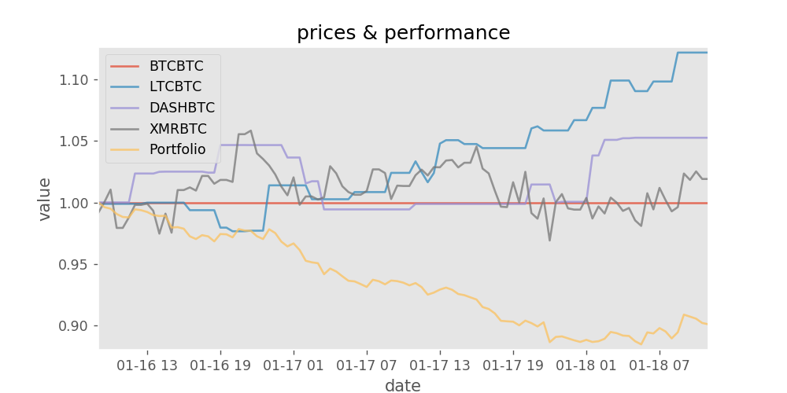
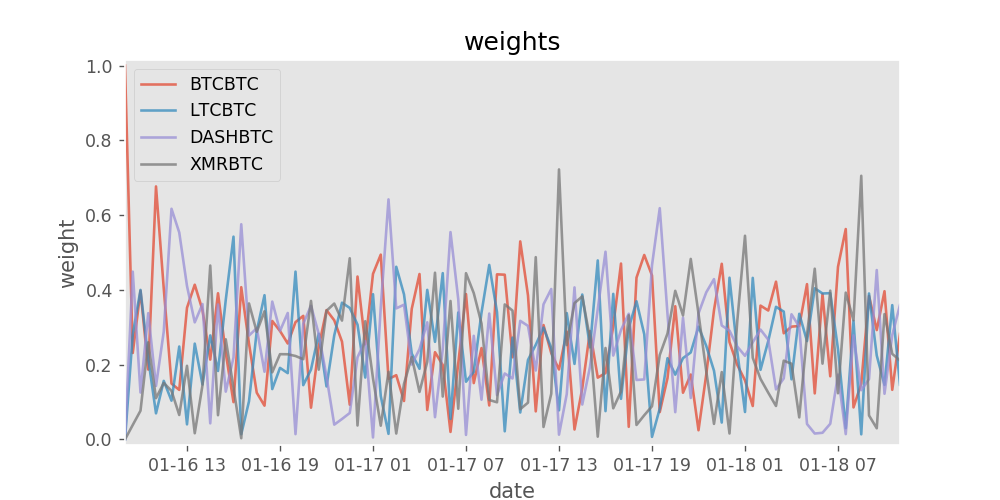

Attempting to replicate "A Deep Reinforcement Learning Framework for the Financial Portfolio Management Problem" by [Jiang et. al. 2017](https://arxiv.org/abs/1706.10059) [1].

**Note2 (20190525):** vermouth1992 improved this environment during their final project, I reccomend you start with their [repo](https://github.com/vermouth1992/drl-portfolio-management). Also check out the [sagemaker tutorial](https://github.com/awslabs/amazon-sagemaker-examples/blob/master/reinforcement_learning/rl_portfolio_management_coach_customEnv/rl_portfolio_management_coach_customEnv.ipynb) which is based on vermouth1992's work.


Note1 (2018): the paper's authors have put [the official code for the paper up and it works well](https://github.com/ZhengyaoJiang/PGPortfolio)

tl;dr I managed to get 8% growth on training data, but it disapeared on test data. So I couldn't replicate it. However, RL papers can be very difficult to replicate due to bugs, framework differences, and hyperparameter sensistivity 

# About

This paper trains an agent to choose a good portfolio of cryptocurrencies. It's reported that it can give 4-fold returns in 50 days and the paper seems to do all the right things so I wanted to see if I could achieve the same results.

This repo includes an environment for portfolio management (with unit tests). Hopefully others will find this usefull as I am not aware of any other implementations (as of 2017-07-17).

Author: wassname

License: AGPLv3

[[1](https://arxiv.org/abs/1706.10059)] Jiang, Zhengyao, Dixing Xu, and Jinjun Liang. "A Deep Reinforcement Learning Framework for the Financial Portfolio Management Problem." *arXiv preprint arXiv:1706.10059* (2017).

# Results

I have managed to overfit to the training data with no trading costs but it could not generalise to the test data. So far there have been poor results. I have not yet tried hyperparameter optimisation so it could be that parameter tweaking will allow the model to fit, or I may have subtle bugs.

- VPG model,
  - training: 190% portfolio growth in 50 days
  - testing: 100% portfolio growth in 50 days


This test period is directly after the training period and it looks like the usefullness of the models learned knowledge may decay as it moves away from its training interval.

There are other experiments stored as notebooks in past commits.

# Installing

- `git clone https://github.com/wassname/rl-portfolio-management.git`
- `cd rl-portfolio-management`
- `pip install -r requirements/requirements.txt`
- `jupyter-notebook`
    - Then open tensorforce-VPG.ipynb in jupyter
    - Or try an alternative agent  with tensorforce-PPO.ipynb and train


# Using the environment

These environments are dervied from the OpenAI environment class which you can learn about in their [documentation](https://gym.openai.com/docs/).


These environments come with 47k steps of training data and 8k test steps. Each step represents 30 minutes. Thanks to reddit user [ARRRBEEE](https://www.reddit.com/r/BitcoinMarkets/comments/694q0a/historical_pricing_data_for_poloniex_btceth_pairs) for sharing the data.

There are three output options which you can use as follows:

```py
import gym
import rl_portfolio_management.environments  # this registers them

env = gym.envs.spec('CryptoPortfolioEIIE-v0').make()
print("CryptoPortfolioEIIE has an history shape suitable for an EIIE model (see https://arxiv.org/abs/1706.10059)")
observation = env.reset()
print("shape =", observation["history"].shape)
# shape = (5, 50, 3)

env = gym.envs.spec('CryptoPortfolioMLP-v0').make()
print("CryptoPortfolioMLP history has an flat shape for a dense/multi-layer perceptron model")
observation = env.reset()
print("shape =", observation["history"].shape)
# shape = (750,)

env = gym.envs.spec('CryptoPortfolioAtari-v0').make()
print("CryptoPortfolioAtari history has been padded to represent an image so you can reuse models tuned on Atari games")
observation = env.reset()
print("shape =", observation["history"].shape)
# shape = (50, 50, 3)
```

Or define your own:
```py
import rl_portfolio_management.environments import PortfolioEnv
df_test = pd.read_hdf('./data/poloniex_30m.hf', key='test')
env_test = PortfolioEnv(
  df=df_test,
  steps=256,
  scale=True,
  augment=0.00,
  trading_cost=0.0025,
  time_cost=0.00,
  window_length=50,
  output_mode='mlp'
)
```

Lets try it with a random agent and plot the results:


```py
import numpy as np
import gym
import rl_portfolio_management.environments  # this registers them

env = gym.envs.spec('CryptoPortfolioMLP-v0').make()
steps = 150
state = env.reset()
for _ in range(steps):
    # The observation contains price history and portfolio weights
    old_portfolio_weights = state["weights"]

    # the action is an array with the new portfolio weights
    # for out action, let's change the weights by around a 20th each step
    action = old_portfolio_weights + np.random.normal(loc=0, scale=1/20., size=(4,))

    # clip and normalize since the portfolio weights should sum to one
    action = np.clip(action, 0, 1)
    action /= action.sum()

    observation, reward, done, info = env.step(action)

    if done:
        break

# plot
env.render('notebook')
```

Unsuprisingly, a random agent doesn't perform well in portfolio management. If it had chosen to bet on blue then black if could have outperformed any single asset, but hindsight is 20/20.




# Plotting

You can run `env.render('notebook')` or extract a pandas dataframe and plot how you like. To use pandas: `pd.DataFrame(gym.unwrapped.infos)`.


# Tests

We have partial test coverage of the environment, just run:

- `python -m pytest`


# Files

- enviroments/portfolio.py - contains an openai environment for porfolio trading
- tensorforce-PPO-IEET.ipynb - notebook to try a policy gradient agent

# Differences in implementation

The main differences from Jiang et. al. 2017 are:

- The first step in a deep learning project should be to make sure the model can overfit, this provides a sanity check. So I am first trying to acheive good results with no trading costs.
- I have not used portfolio vector memory. For ease of implementation I made the information available by using the last weights.
- Instead of DPG ([deterministic policy gradient](http://jmlr.org/proceedings/papers/v32/silver14.pdf)) I tried and DDPG ([deep deterministic policy gradient]( http://arxiv.org/pdf/1509.02971v2.pdf)) and VPG (vanilla policy gradient) with generalized advantage estimation and PPO.
- I tried to replicate the best performing CNN model from the paper and haven't attempted the LSTM or RNN models.
- instead of selecting 12 assets for each window I chose 3 assets that have existed for the longest time
- ~~My topology had an extra layer [see issue 3](https://github.com/wassname/rl-portfolio-management/issues/3)~~ fixed

# TODO

See issue [#4](https://github.com/wassname/rl-portfolio-management/issues/4) and [#2](https://github.com/wassname/rl-portfolio-management/issues/2) for ideas on where to go from here
